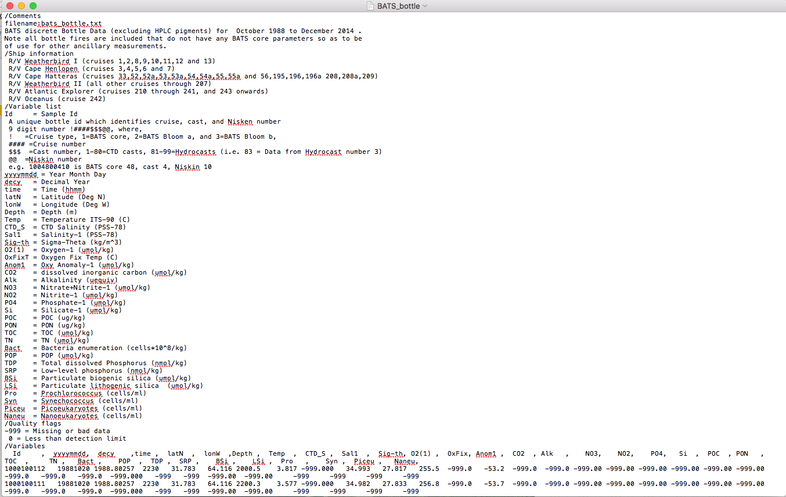

As much fun as it is to make up our own data, we are now going to start working with a real dataset.  

To do this, we will begin by working with a script file. This allows us to save all of the lines of code that we create so we can easily modify it when needed.  

It is good practice to first begin your script by indicating the name of the script, what is does, when it was created and by whom. Additionally, it is good to make sure that you start with a clean R environment so that you don't accidently use incorrect values (more on this later).  

## Comments 
You probably noticed how some of the code that we have looked at has '#' in front of it. By starting a line with this symbol, we are telling R to not run this line as part of the script. This allows us to leave notes for ourselves (comments) that can be incredibly helpful in keeping track of what we are doing, especially if we haven't used the script in a long time.

Here is an example of how to start your script...  
```{r}
# BATS_load_data.R
# This script loads BATS data into R
# Created by ----, on day/month/year

# clear out the R environment of any stored values
rm(list=ls())
# Force R to avoid storing strings as factors when uploading data
options(stringsAsFactors=FALSE)
# display working directory
getwd()
```

Next we can load in our data file. It is good practice to look at your datafile in TextEdit or a similar program prior to loading into R to check for potential issues with data format.



What do we notice about the formatting?

Let's try reading it in as a csv file
```{r, message=FALSE, warning=FALSE, include=FALSE}
# read in BATS bottle file (attempt 1)
raw <- read.table("BATS_bottle.txt")
```

Failure. Looking back at the screenshot, did you notice how we really don't get to any of the actual data until a ways down the file? What we are seeing is primarily metadata that is very useful for understanding the dataset, but is not needed for looking at the data in R. Fortunately, we can tell R to skip over those lines (58 of them!) and only read in the data that we want using the *skip* argument in the **read.table()** function.  

```{r}
# read in BATS bottle file (attempt 3)
raw <- read.table("BATS_bottle.txt", skip=58, header=FALSE )
```

No success here either! The problem seems to be in the way that this file is formatted, in which the header row containing the value names has a funky fort with both tab and commas while the data is tab-separated. Weird, right?  

Let's add one more line to our *skip* argument to remove this wacky header line and try again.  

```{r}
# read in BATS bottle file (attempt 4)
raw <- read.table("BATS_bottle.txt", skip=59, header=FALSE )
str(raw)
```

FINALLY!!! If you were doing this for the first time, you could have sat at this hurdle for a long time! This is a really great example of how you sometimes need to use a problem-solving approach when working with code.  

Now that we have our data in here, we need to add back our header so we know what each vector refers to in the dataframe.  

```{r}
# create a vector containing the names that we need in our header
header <- c("Id","yyyymmdd","decy","time","latN","lonW","Depth","Temp", 
            "CTD_S","Sal1","Sig_th","O2_1","OxFix","Anom1","CO2","Alk",
            "NO3","NO2","PO4","Si","POC","PON","TOC","TN","Bac","POP",
            "TDP","SRP","BSi","LSi","Pro","Syn","Piceu","Naneu")
# put header names into column names
colnames(raw) <- header 
# check structure
str(raw)
```

The next step is to make the data a little more user friendly. Did you notice all of the values labeled '-999' that showed up in the structure function? They represent observations in which no data was collected for that particular variable. If we used them in their current state, any mathematical calculations would be messed up. The solution? Convert them to 'NA' values.

Whenever you are going to be altering your dataset (hopefully in a positive fashion!) it is good to store the new version under a different name. This way you can easily compare the new version to the original and see how it was changed. Again, we want to run **str()** to see the structure of our dataframe.

```{r}
# store raw dataframe under new name
data <- raw
# convert all values of '-999' to 'NA' in the dataframe 'data'
data[data == -999] <- NA
# check the dataframe structure
str(data)
```

We should also have a quick look to see if there are any other weird values showing up in our dataframe. One way to do this is to use the **summary()** function, which will calculate basic statistics describing the distribution of values for each vector.
```{r}
# check for any other weird values in dataframe
summary(data)
```

OK, everything looks good here.  
 <br>  
 
Now let's try splitting up values to make new data columns  

If you remember back to the metadata from BATS_bottle.txt, the first column 'Id' is a unique bottle identifier that contains many useful pieces of information. It states:  
Id = Sample Id                    
 A unique bottle id which identifies cruise, cast, and Nisken number  
 9 digit number !####\$\$\$@@, where,  
 !   =Cruise type, 1=BATS core, 2=BATS Bloom a, and 3=BATS Bloom b,   
 #### =Cruise number  
 \$ \$ \$  =Cast number, 1-80=CTD casts, 81-99=Hydrocasts (i.e. 83 = Data from Hydrocast number 3)  
 @@  =Niskin number  
 e.g. 1004800410 is BATS core 48, cast 4, Niskin 10  
 
 <br>
 
Let's split up Id into mutliple columns to that we can better use this metadata. To identify a column in a data frame, we use a **\$** followed by the column name (for example, data\$Id). Next, we will use the function **substr()** to subdivide the string found in data\$Id. To use this function, we need to specify the column that we are dividing (data\$Id), the character we are starting at (the first), and the character we are ending at (also the first). This will allow us to create a value from the first character in each Id value.   
**NOTE**: this only works for character strings, not for numeric values. Check the value's class if there are any issues.
 
```{r}
# create new column for dataframe 'data'
data$cruise.type <- substr(data$Id, 1, 1)  
# check structure
str(data)
```

Now let's further separate the data from data\$Id
```{r}
# create column for 'cruise'
data$cruise <- substr(data$Id, 2,5)
# create vector for 'cast'
data$cast <- substr(data$Id, 6,8)
# create vector for 'bottle'
data$bottle <- substr(data$Id, 9,10)
# check structure
str(data)
```

###  Awesome! Now we can start exploring our data!